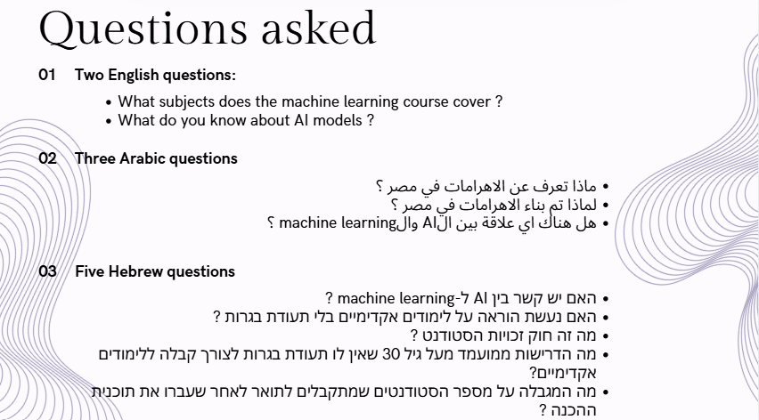
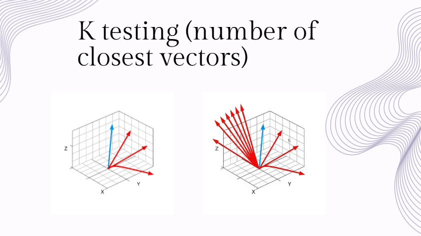
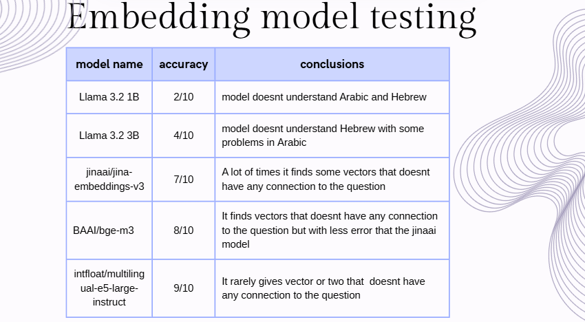

# RAG-final-project

# Project Overview

This project implements a Retrieval-Augmented Generation (RAG) system designed to help college staff manage and query large volumes of interconnected files in multiple languages (English, Arabic, Hebrew).

The system provides:

- Document upload & storage with metadata.

- Embedding-based search for efficient retrieval.

- Chat-like Q&A interface where users can ask natural language questions and receive precise answers.

- Multilingual support, ensuring accessibility across different languages.

-----------------------------------------------------------------------------------------------------------------------------
# System Architecture

- Frontend: React web application

Displays uploaded files with search/filter.

Chat-like Q&A interface for interacting with the RAG system.

- Backend: Flask server

Handles file uploads, preprocessing, embedding, and querying.

Updates FAISS vector database.

- Database: FAISS + local storage

Stores embeddings and metadata.

Maintains uploaded files.

- Models:

Embeddings model

Text Generation model

-----------------------------------------------------------------------------------------------------------------------------
# Features

- Upload files in various formats (txt, html, pdf).

- Extract text, embed content, and store efficiently.

- Ask natural language questions and retrieve relevant answers.

- Multi-language query support.

- User-friendly React UI with file list + chat window.

-----------------------------------------------------------------------------------------------------------------------------
# Testing & Evaluation

- Tested the system with 10 different questions

  The questions:

  

- Did three different tests
  1- K testing (number of closest vectors)

   

  2- Embedding model testing

   

  3- Text Generation model testing

   

-----------------------------------------------------------------------------------------------------------------------------
